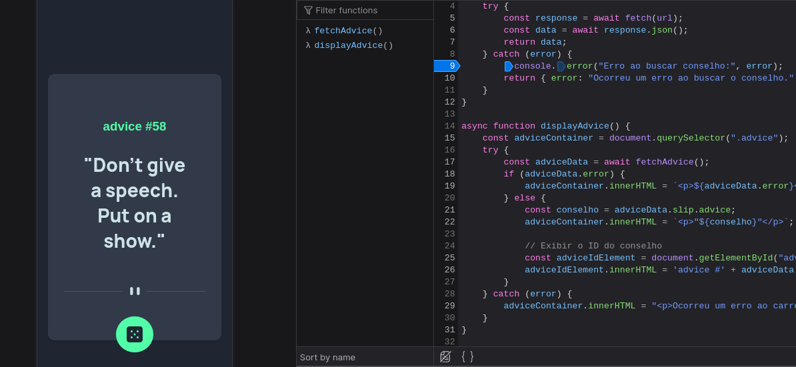
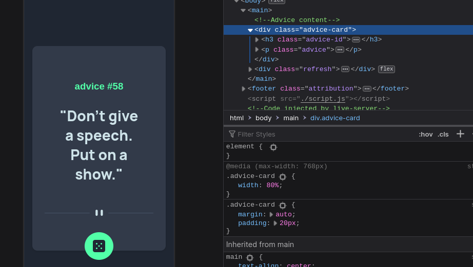

# Advice generator app

 

## Screenshot

### Link

- Live Site URL(building): ()

### Built with

- Semantic HTML5 markup
- CSS custom properties
- Flexbox
- Mobile-first workflow
- javascript

### What I learned

In this exposition, I delve into the realm of API fetching and the acquisition of knowledge surrounding HTTP requests and error handling.

 try {
        const response = await fetch(url);
        const data = await response.json();
        return data;
    } catch (error) {
        ...
         };

### Useful resources

[Fetch API - JavaScript Tutorial for beginners](https://www.youtube.com/watch?v=ubw2hdQIl4E) 

## Author

- Codepen - [_romeu](https://codepen.io/_romeu)

